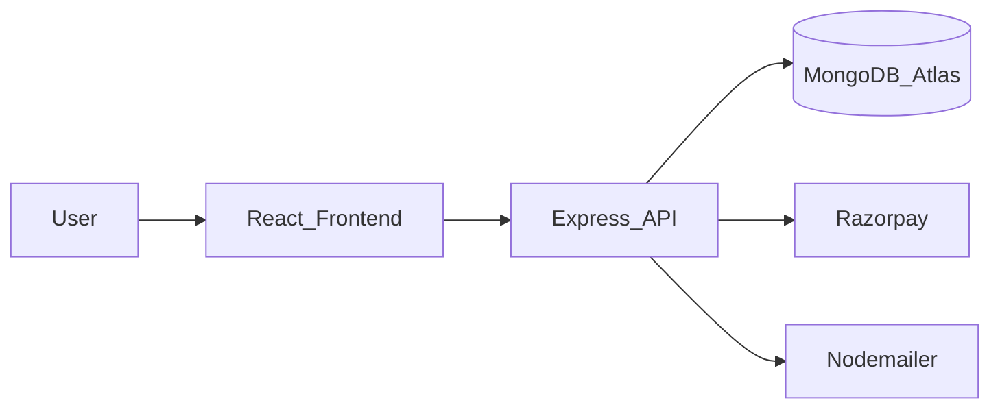

# FoodApp Frontend

**Meal-plan delivery web app** — browse plans, sign up, book, pay with Razorpay, and manage your profile.

| | |
|---|---|
| **This repo (UI)** | [FoodApp_Frontend](https://github.com/Jayesh049/FoodApp_Frontend) |
| **Backend (API)** | [FoodApp_Backend](https://github.com/Jayesh049/FoodApp_Backend) |
| **Architecture (developers)** | [docs/ARCHITECTURE.md](docs/ARCHITECTURE.md) |

---

## How it works (plain English)

1. You open the site and explore **meal plans** (like a restaurant menu of weekly packages).
2. You **create an account** or log in; the site remembers you safely via the API.
3. You **book a plan**; payment goes through **Razorpay** (a real payment gateway).
4. Your **profile** shows bookings; admins can manage plans/sections when signed in as admin.



Recruiters: this README is enough to understand the product.  
Engineers: see [docs/ARCHITECTURE.md](docs/ARCHITECTURE.md) for routes, auth guards, and folder layout.

---

## What you can do in the app

- Home, plans catalog, and plan detail pages
- Signup / login / email verify / forgot & reset password
- Cart-style booking flow and payment success handling
- Profile page for the signed-in user
- Reviews and contact
- Admin areas (plans, sections, RAG tooling) behind admin checks

---

## Stack

| Layer | Choice |
|-------|--------|
| UI | React 18 |
| Build | Vite (+ TypeScript checks in build) |
| Routing | React Router v5 |
| HTTP | Axios (credentials / cookies with API) |
| Auth UX | `AuthProvider`, `RequireAuth`, `RequireAdmin` |
| Payments | Razorpay checkout (via backend keys) |
| E2E | Playwright |

---

## Quick start (local)

```powershell
cd foodAppFrontend
npm install
npm start
```

App typically runs on **http://localhost:3001** (or the Vite default shown in the terminal).  
Run the [Backend](https://github.com/Jayesh049/FoodApp_Backend) on port **3000** and point the frontend proxy / API base URL at it.

```powershell
npm run build
npm run test:e2e
```

---

## Sibling backend

API source: **[Jayesh049/FoodApp_Backend](https://github.com/Jayesh049/FoodApp_Backend)**  
Copy Backend `.env.example`, set `FRONTEND_URL` to this app’s origin, then `npm start` in Backend.

---

## Portfolio note

Built to demonstrate full-stack product thinking: real auth flows, payments, and a clear UI↔API split. Strong for mid/senior portfolio review; elite compensation roles also weigh interviews, security depth, and production experience beyond a single demo.

---

## License

See repository / `package.json`.
