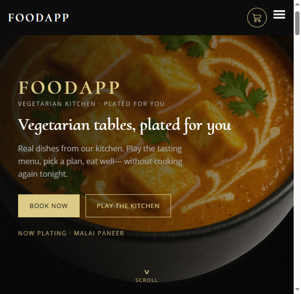
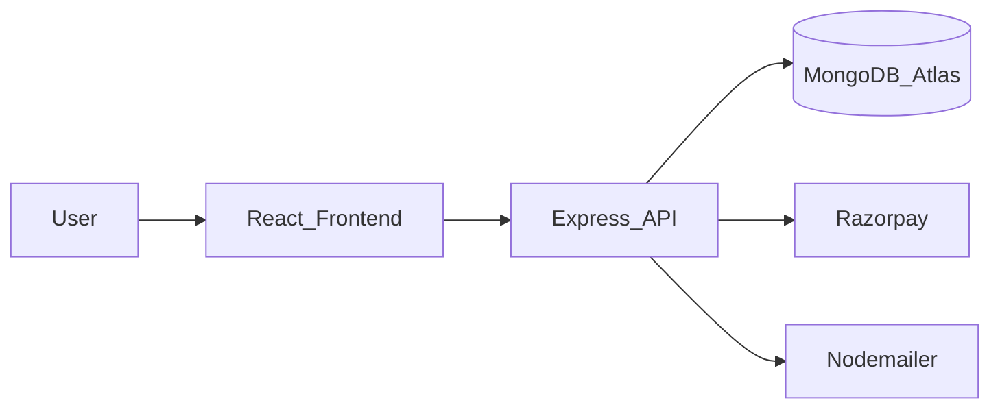

# FoodApp Frontend

[](https://github.com/Jayesh049/FoodApp_Frontend/actions/workflows/ci.yml)
[](LICENSE)

Vegetarian meal plans you can open and order. [Live app](https://foodapp-frontend-z1zg.onrender.com) · [Built vs template](docs/BUILT_VS_TEMPLATE.md)



Checkout ignores the total sent by the browser and charges the stored plan price. Payment confirm is once, for the owner of that order. The session cookie is httpOnly, and logout kills it.


Live API: [https://foodapp-backend-joksepha.onrender.com/health](https://foodapp-backend-joksepha.onrender.com/health)

## Engineering decisions

- **Server-side pricing** — the UI never sends a trusted total; the API recomputes from the plan.
- **httpOnly cookie + CSRF** — no JWT in `localStorage`; mutating calls send the CSRF header.
- **Webhook + reconcile (API)** — payment truth lives on the server after signature verify.
- **RAG fallback** — suggestions stay usable when the model is down (name search).
- **Lazy routes** — each page loads its own chunk; nav stays mounted.

| | |
|---|---|
| **This repo (UI)** | [FoodApp_Frontend](https://github.com/Jayesh049/FoodApp_Frontend) |
| **Backend (API)** | [FoodApp_Backend](https://github.com/Jayesh049/FoodApp_Backend) |
| **Architecture (developers)** | [docs/ARCHITECTURE.md](docs/ARCHITECTURE.md) |

---

## How it works (plain English)

1. You open the site and explore **meal plans** (like a restaurant menu of weekly packages).
2. You **create an account** or log in; the site remembers you safely via the API.
3. You **book a plan**; payment goes through **Razorpay** (a real payment gateway).
4. Your **profile** shows bookings; admins can manage plans/sections when signed in as admin.



Recruiters: this README is enough to understand the product.  
Engineers: see [docs/ARCHITECTURE.md](docs/ARCHITECTURE.md) for routes, auth guards, and folder layout.

---

## What you can do in the app

- Home, plans catalog, and plan detail pages
- Signup / login / email verify / forgot & reset password
- Cart-style booking flow and payment success handling
- Profile page for the signed-in user
- Reviews and contact
- Admin areas (plans, sections, RAG tooling) behind admin checks

---

## Stack

| Layer | Choice |
|-------|--------|
| UI | React 18 |
| Build | Vite (+ TypeScript checks in build) |
| Routing | React Router v6 |
| HTTP | Axios (credentials / cookies with API) |
| Auth UX | `AuthProvider`, `RequireAuth`, `RequireAdmin` |
| Payments | Razorpay checkout (via backend keys) |
| E2E | Playwright |

---

## Quick start (local)

```powershell
cd foodAppFrontend
npm install
npm start
```

App typically runs on **http://localhost:3001** (or the Vite default shown in the terminal).  
Run the [Backend](https://github.com/Jayesh049/FoodApp_Backend) on port **3000** and point the frontend proxy / API base URL at it.

```powershell
npm run build
npm run test:e2e
```

---

## Sibling backend

API source: **[Jayesh049/FoodApp_Backend](https://github.com/Jayesh049/FoodApp_Backend)**  
Copy Backend `.env.example`, set `FRONTEND_URL` to this app’s origin, then `npm start` in Backend.

---

## Portfolio note

Built to demonstrate full-stack product thinking: real auth flows, payments, and a clear UI↔API split. Strong for mid/senior portfolio review; elite compensation roles also weigh interviews, security depth, and production experience beyond a single demo.

---

## License

[MIT](LICENSE). GitHub sidebar fields: [docs/GITHUB_PRESENTATION.md](docs/GITHUB_PRESENTATION.md).
