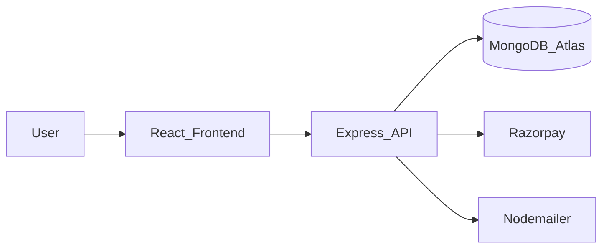
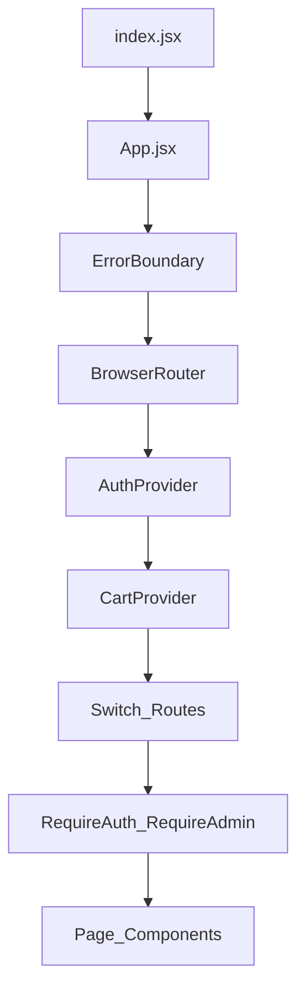
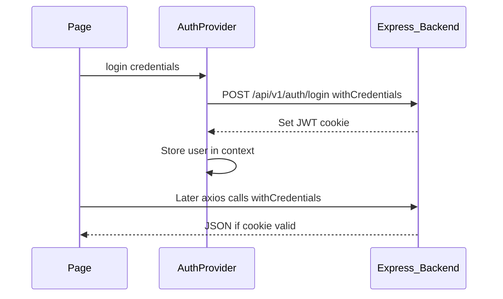

# FoodApp Frontend — Architecture

Non-technical overview: [README.md](../README.md).  
API: [FoodApp_Backend](https://github.com/Jayesh049/FoodApp_Backend) → see its `docs/ARCHITECTURE.md`.

## System context



## Folder map

| Path | Role |
|------|------|
| `src/App.jsx` | Route table + providers |
| `src/index.jsx` | React bootstrap |
| `src/Components/Context/AuthProvider.jsx` | Auth state + login/logout helpers |
| `src/Components/Auth/` | `RequireAuth`, `RequireAdmin` route guards |
| `src/Components/Home Page/` | Landing, nav, contact, booking entry, payments |
| `src/Components/Login Page/` | Signup, login, OTP, verify, reset |
| `src/Components/Plan Page/` | All plans + plan details |
| `src/Components/Profile Page/` | User profile |
| `src/Components/Cart/` | Cart provider / sidebar |
| `src/Components/Admin/` | Admin plans, sections, RAG |
| `src/utils/` | Plan API helpers, filters, display |
| `src/setupProxy.js` | Dev proxy toward backend (when used) |
| `e2e/` / Playwright | End-to-end smoke (if present) |

Do **not** commit a nested `Backend/` copy, `*.rar`, or `*.zip` archives into this repo.

## App composition



## Primary routes

| Path | Page | Notes |
|------|------|--------|
| `/` | Home | Marketing + featured plans |
| `/allPlans` | All plans | Catalog |
| `/planDetails/:id` | Plan detail | Buy → booking |
| `/login`, `/signup`, … | Auth flows | Verify / OTP / reset |
| `/profilePage` | Profile | Signed-in user |
| `/booking1` | Booking | Wrapped in `RequireAuth` |
| `/paymentsuccess` | Payment success | Post-Razorpay |
| Admin routes | Admin* | Wrapped in `RequireAdmin` |

Exact admin paths live in `App.jsx` — keep guards around any privileged UI.

## Auth + API calls



- Prefer **role from API** (`user.role`) for admin UI — not hardcoded emails.
- `RequireAuth` / `RequireAdmin` gate sensitive routes client-side; the **backend must still enforce** authz on every privileged endpoint.

## Build & quality

```powershell
npm start          # Vite dev
npm run build      # tsc --noEmit && vite build
npm run typecheck
npm run test:e2e   # Playwright
```

## Env / config

- Do not commit `.env` (ignored). Use local env or proxy config for API base URL.
- Backend CORS must allow this origin via `FRONTEND_URL`.

## Related backend docs

Clone and run [FoodApp_Backend](https://github.com/Jayesh049/FoodApp_Backend); read its architecture for MVC routes, Razorpay verify, and security middleware.
